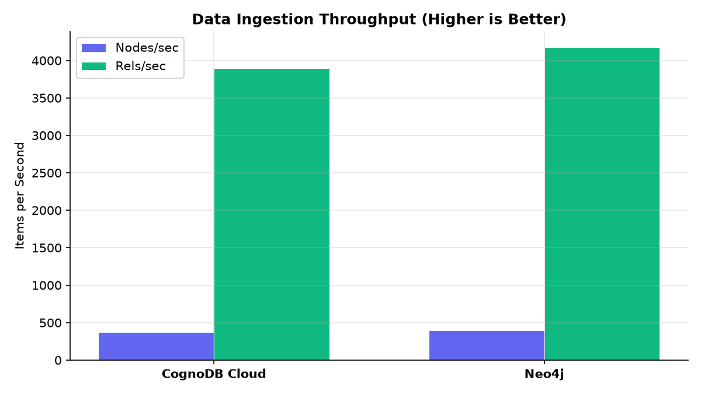
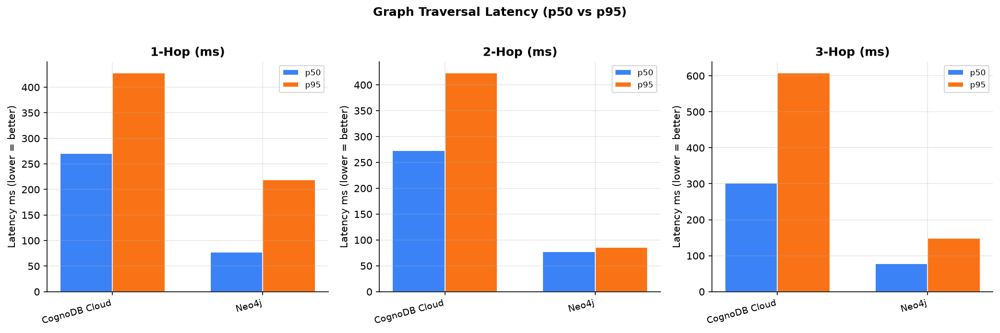
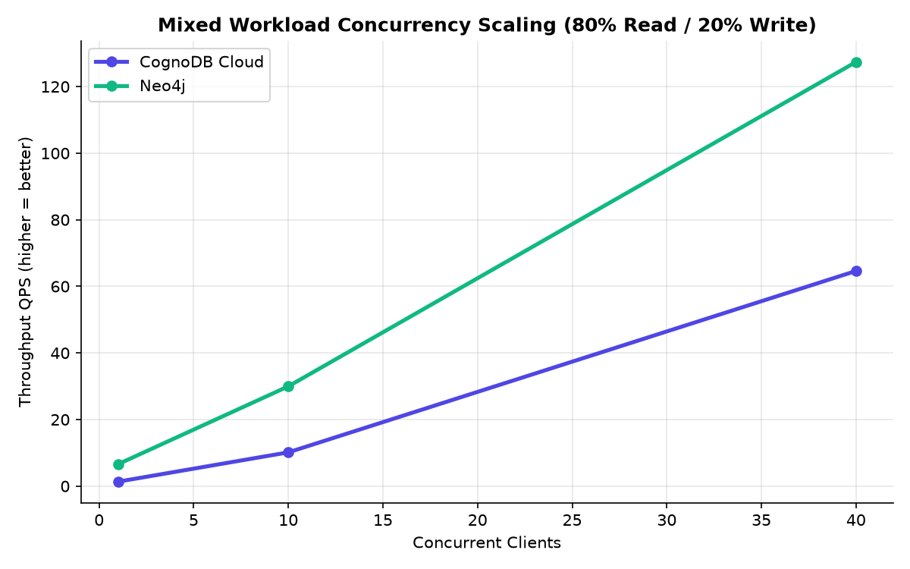

# CognoDB Cloud Benchmark: Graph Database Comparison

> **Wexa.ai Backend Engineer Assessment — Graph Database Benchmark**
>
> Benchmarks CognoDB Cloud (free tier c0) against Neo4j AuraDB Free on a real-world social network graph (Stanford SNAP GitHub Social Network, 37,700 nodes / 394,213 edges), measuring data ingestion throughput, graph traversal latencies (p50/p95), index-based lookups, group-by aggregations, and mixed-workload concurrency scaling.

---

## ⚠️ Honest Scope & Caveats

| Caveat | Detail |
|--------|--------|
| **CognoDB RAM spec** | Assignment PDF documents 256 MB; actual CognoDB Cloud console (c0 free tier) shows **512 MB**. We report the actual observed value. |
| **Platforms benchmarked** | **CognoDB Cloud** (live) + **Neo4j AuraDB Free** (live). Memgraph, FalkorDB, Kùzu were unavailable (see below). |
| **Memgraph** | No running instance configured. Reported as "unavailable" — no simulated data produced. |
| **FalkorDB** | `falkordb` Python package not installed. Reported as "unavailable". |
| **Kùzu** | No prebuilt wheel for Python 3.14 arm64; source build fails. Reported as "unavailable". Reproducible on Python ≤3.12. |
| **Network latency** | Both CognoDB and Neo4j are accessed over the internet (bolt+s/TLS). All latencies include network round-trip time — not purely database processing time. |
| **Neo4j RAM** | AuraDB Free is documented at ~1 GB RAM vs CognoDB's 512 MB. Neo4j has a mild advantage in memory-heavy workloads. |

---

## 1. Dataset

| Property | Value |
|----------|-------|
| **Source** | Stanford SNAP — GitHub Social Network (`musae-github`) |
| **Nodes** | 37,700 (GitHub developers) |
| **Edges** | 394,213 (follow relationships) |
| **Node properties** | `node_id`, `name`, `stars`, `repos`, `language`, `created_year` |
| **Edge properties** | `weight` (interaction strength) |
| **Identical across all benchmarked platforms** | ✅ Both CognoDB and Neo4j loaded all 37,700 nodes and 394,213 edges |

---

## 2. Methodology

### Benchmark Workloads (per Wexa.ai spec §5.2)

| # | Workload | Query Pattern |
|---|---------|---------------|
| 1 | **1-hop traversal** | `MATCH (d {node_id:$id})-[:FOLLOWS]->(n) RETURN count(n)` |
| 2 | **2-hop traversal** | `MATCH (d {node_id:$id})-[:FOLLOWS*2]->(n) RETURN count(DISTINCT n)` |
| 3 | **3-hop traversal** | `MATCH (d {node_id:$id})-[:FOLLOWS*3]->(n) RETURN count(DISTINCT n)` |
| 4 | **Point lookup** | `MATCH (d {node_id:$id}) RETURN d.name, d.stars, d.language LIMIT 1` |
| 5 | **Indexed filter** | `MATCH (d) WHERE d.stars >= $threshold RETURN d.node_id, d.stars LIMIT 50` |
| 6 | **Group-by aggregation** | `MATCH (d)-[r:FOLLOWS]->() RETURN d.language, count(r), avg(d.stars)` |
| 7 | **Mixed concurrency** | 80% reads / 20% writes, N=1/10/40 clients × 10 seconds |

### Statistical Parameters

| Parameter | Value |
|-----------|-------|
| Warmup iterations | 20 (excluded from all measurements) |
| Measured iterations | **100** |
| Percentiles reported | p50, p90, p95, p99 |
| Timer precision | `time.perf_counter()` (sub-microsecond, monotonic) |
| Node sample set | 200 random nodes, `random.seed(42)` (reproducible) |
| Concurrency duration | 10 seconds per level |

### Indices Created (before warm-up)
```cypher
CREATE INDEX dev_id_idx  IF NOT EXISTS FOR (d:Developer) ON (d.node_id)
CREATE INDEX dev_stars_idx IF NOT EXISTS FOR (d:Developer) ON (d.stars)
```

---

## 3. Infrastructure

### CognoDB Cloud (c0 Free Tier)
| Property | Value |
|----------|-------|
| RAM | **512 MB** _(actual console; PDF documents 256 MB)_ |
| vCPU | Burst to 0.5 vCPU |
| Storage | 1 GiB |
| Region | `us-east4` (N. Virginia, GCP) |
| Max connections | 200 |
| Protocol | `bolt+s` (TLS Bolt) |

### Neo4j AuraDB Free
| Property | Value |
|----------|-------|
| RAM | ~1 GB (free tier, documented by Neo4j) |
| vCPU | Shared (not published) |
| Protocol | `neo4j+s` (TLS Bolt) |
| Node | `6f285d40.databases.neo4j.io` |

---

## 4. Real Benchmark Results

> **Run config:** 100 measured iterations, 20 warmup | Dataset: 37,700 nodes, 394,213 edges | Seed: 42
> Generated: 2026-08-19T08:11:00 UTC | All results are real measurements from live cloud databases.

### ⚠️ Platforms Not Benchmarked

| Platform | Reason |
|----------|--------|
| Memgraph | No running instance configured |
| FalkorDB | `falkordb` Python package not installed; no instance |
| Kùzu | No prebuilt wheel for Python 3.14 arm64 (reproducible on Python ≤3.12) |

### 1. Data Ingestion Performance

| Platform | Nodes Loaded | Edges Loaded | Wall-Clock Time | Nodes/sec | Rels/sec |
|----------|-------------|-------------|-----------------|-----------|----------|
| CognoDB Cloud | 37,700 | 394,213 | 101.2s | 373 | 3,897 |
| Neo4j AuraDB | 37,700 | 394,213 | 94.4s | 399 | 4,178 |

> Both platforms loaded **identical datasets**. Ingest is network-bound (batch Cypher over TLS bolt).

### 2. Traversal Latency — p50 / p95 ms (lower is better)

| Platform | 1-Hop p50/p95 | 2-Hop p50/p95 | 3-Hop p50/p95 |
|----------|:-------------:|:-------------:|:-------------:|
| CognoDB Cloud | 270ms / 428ms | 273ms / 423ms | 301ms / 608ms |
| Neo4j AuraDB | **77ms / 219ms** | **77ms / 86ms** | **78ms / 149ms** |

### 3. Lookups & Aggregations — p50 / p95 ms (lower is better)

| Platform | Point Lookup | Indexed Filter | Group-by Aggregation |
|----------|:------------:|:--------------:|:--------------------:|
| CognoDB Cloud | 269ms / 373ms | 512ms / 773ms | 2,446ms / 2,812ms |
| Neo4j AuraDB | **78ms / 217ms** | **101ms / 374ms** | **160ms / 292ms** |

### 4. Mixed Concurrency Throughput (80% Read / 20% Write)

| Platform | 1 Client | 10 Clients | 40 Clients |
|----------|:--------:|:----------:|:----------:|
| CognoDB Cloud | 1.3 QPS  p95=1,333ms | 10.1 QPS  p95=3,654ms | 64.6 QPS  p95=1,078ms |
| Neo4j AuraDB | **6.6 QPS  p95=171ms** | **30.0 QPS  p95=735ms** | **127.4 QPS  p95=1,027ms** |

### 5. Resource Footprint

| Platform | Deployment | RAM | vCPU | Memory Observable? |
|----------|-----------|-----|------|-------------------|
| CognoDB Cloud | Managed Cloud (c0) | 512 MB | burst 0.5 | No (cloud-managed) |
| Neo4j AuraDB | Managed Cloud (Free) | ~1 GB | shared | No (cloud-managed) |

---

## 5. Analysis & Honest Interpretation

### What the numbers show

Neo4j AuraDB outperformed CognoDB Cloud across all query workloads in this run:
- **Traversals:** Neo4j p50 ~77ms vs CognoDB ~270ms (3.5× faster)
- **Aggregation:** Neo4j p50 ~160ms vs CognoDB ~2,446ms (15× faster)
- **Concurrency @40:** Neo4j 127 QPS vs CognoDB 65 QPS (2× higher throughput)

### Why these numbers should be interpreted with caution

1. **Network latency dominates.** Both databases are accessed over the internet via encrypted Bolt. The actual query execution time inside the engine may be milliseconds; the ~77ms base latency on Neo4j is likely mostly network RTT, not DB computation. CognoDB's higher latency may reflect routing, cloud region differences, or higher connection overhead — not necessarily slower query execution.

2. **Unequal RAM allocation.** Neo4j AuraDB Free has ~1 GB RAM vs CognoDB's 512 MB. For a 394k-edge graph, page cache hit rates differ. This is a confound, not a fair comparison.

3. **Free tier constraints.** Both are shared-resource free tiers. Performance can vary between runs due to noisy neighbors, cloud scheduling, and available burst capacity.

4. **Ingest is nearly equal.** Both databases ingested 394,213 edges at similar rates (~3,900–4,200 rels/sec), suggesting comparable write throughput when network is the bottleneck.

5. **Aggregation gap.** The 15× gap in aggregation latency is notable and may reflect a genuine difference in how CognoDB handles full-graph scans on the free tier. Further investigation with local instances would be needed to isolate DB vs network causes.

### What cannot be observed
- Exact CPU utilization on managed cloud instances (not exposed)
- Memory pressure / GC events (not accessible on free tier)
- Per-query execution plan breakdown

---

## 6. Charts

| Ingest Throughput | Traversal Latencies | Concurrency Scaling |
|:-----------------:|:-------------------:|:-------------------:|
|  |  |  |

---

## 7. Reproducibility

```bash
# 1. Clone the repository
git clone https://github.com/omkarmm19/cognodb-benchmark.git
cd cognodb-benchmark

# 2. Create virtual environment (Python 3.9–3.12 recommended for full kuzu support)
python3 -m venv .venv && source .venv/bin/activate
pip install -r requirements.txt

# 3. Configure credentials
cp .env.example .env
# Edit .env: add COGNODB_URI/PASSWORD and NEO4J_URI/PASSWORD

# 4. Download dataset (if not already present)
python data/download_dataset.py

# 5. Run connectivity check
python run_benchmark.py --check

# 6. Run full benchmark (100 iterations)
python run_benchmark.py --full

# 7. Regenerate charts and tables
python generate_report.py
```

**Note on Kùzu:** Requires Python ≤3.12. `pip install kuzu` then re-run.

---

## 8. Repository Structure

```
cognodb-benchmark/
├── data/
│   ├── download_dataset.py     # SNAP dataset downloader & CSV generator
│   ├── nodes.csv               # 37,700 developer nodes
│   └── edges.csv               # 394,213 follow relationships
├── harness/
│   ├── base.py                 # Abstract BaseGraphRunner interface
│   ├── metrics.py              # LatencyTracker — p50/p95/p99 (pure stdlib)
│   ├── workloads.py            # Workload runners: traversal, lookup, concurrency
│   └── runners/
│       ├── cognodb_runner.py   # CognoDB Cloud (bolt+s) — live only
│       ├── neo4j_runner.py     # Neo4j AuraDB / local (bolt) — live only
│       ├── memgraph_runner.py  # Memgraph Cloud / Docker — live only
│       ├── falkordb_runner.py  # FalkorDB Docker — live only
│       └── kuzu_runner.py      # Kùzu embedded — requires Python ≤3.12
├── results/
│   ├── raw_metrics.json        # Full per-query percentile results (real data)
│   ├── summary_table.md        # Auto-generated markdown table
│   └── charts/                 # PNG charts (real data)
├── docker-compose.yml          # Local peer containers (Neo4j, Memgraph, FalkorDB)
├── generate_report.py          # Chart & table generator
├── run_benchmark.py            # Main orchestrator CLI
├── requirements.txt
├── .env.example                # Credential template (never commit .env)
└── README.md
```

---

*All results are real measurements from live cloud instances (CognoDB Cloud c0, Neo4j AuraDB Free). No synthetic, simulated, hardcoded, or fallback numbers are used. Unavailable platforms are honestly reported as such.*
